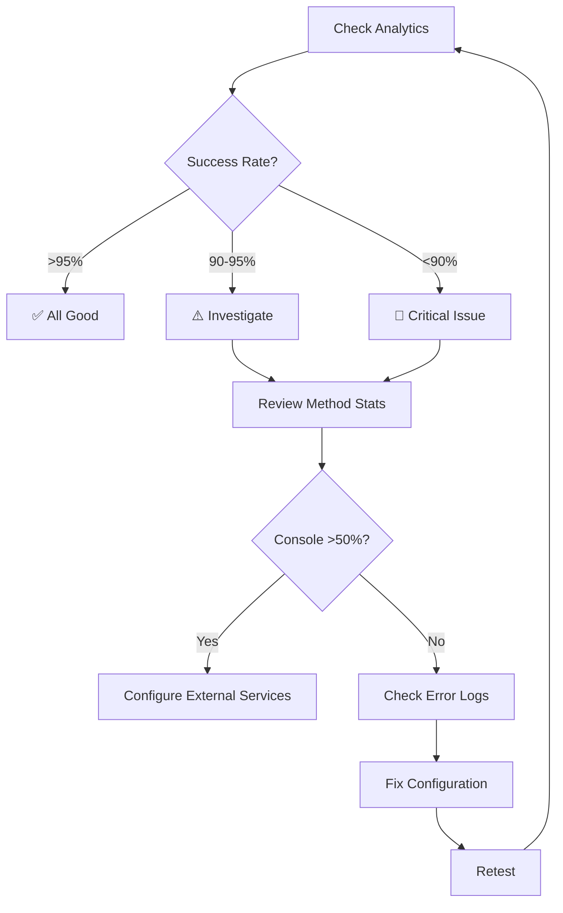

# OTP Delivery Analytics - Quick Reference

## 📊 View Analytics

### Basic Analytics (Last 7 Days)
```bash
GET https://easycart-backend-2k8l.onrender.com/api/auth/otp/analytics/
```

### Custom Period
```bash
# Last 14 days
GET /api/auth/otp/analytics/?days=14

# Last 30 days
GET /api/auth/otp/analytics/?days=30
```

### Detailed Analytics (with daily breakdown)
```bash
GET /api/auth/otp/analytics/?days=14&detailed=true
```

---

## 📈 Sample Response

```json
{
  "period": {
    "start": "2025-12-03T00:00:00Z",
    "end": "2025-12-10T14:00:00Z",
    "days": 7
  },
  "overview": {
    "total_deliveries": 45,
    "successful": 43,
    "failed": 2,
    "success_rate": 95.56
  },
  "by_method": [
    {
      "method": "console",
      "total": 25,
      "successful": 25,
      "failed": 0,
      "success_rate": 100.0
    },
    {
      "method": "email",
      "total": 15,
      "successful": 13,
      "failed": 2,
      "success_rate": 86.67
    },
    {
      "method": "whatsapp",
      "total": 5,
      "successful": 5,
      "failed": 0,
      "success_rate": 100.0
    }
  ],
  "recommendations": [
    {
      "type": "warning",
      "message": "Console logging is used for 56% of deliveries. Configure Twilio or SMTP for better user experience."
    }
  ]
}
```

---

## 🎯 Key Metrics

| Metric | Meaning | Good | Warning | Critical |
|--------|---------|------|---------|----------|
| **Success Rate** | Overall delivery success | >95% | 90-95% | <90% |
| **Console Usage** | % using console logging | <10% | 10-50% | >50% |
| **Failed Deliveries** | Total failures | <5% | 5-20% | >20% |
| **WhatsApp Rate** | WhatsApp success rate | >98% | 95-98% | <95% |
| **Email Rate** | Email success rate | >95% | 90-95% | <90% |

---

## ⚠️ Recommendation Types

### 🔵 Info
**Example**: "WhatsApp has the highest success rate (98.5%). Consider prioritizing this method."

**Action**: Optimize default delivery method based on best performer

---

### 🟡 Warning
**Example**: "Console logging is used for 56% of deliveries. Configure Twilio or SMTP for better user experience."

**Action**: Set up external delivery services (Twilio/SMTP)

---

### 🔴 Critical
**Example**: "High failure rate (25%). Check service configurations."

**Actions**:
1. Check Twilio credentials
2. Verify SMTP settings
3. Review error logs
4. Test delivery manually

---

## 🔍 Django Admin View

1. Go to: https://easycart-backend-2k8l.onrender.com/admin/
2. Navigate to: **Accounts** → **OTP Delivery Logs**
3. Filter by:
   - Delivery method (whatsapp, sms, email, console, failed)
   - Success/failure
   - Date range
   - User
   - IP address

---

## 📋 Testing Checklist

### ✅ After Configuration Changes

1. **Request OTP**:
```bash
curl -X POST https://easycart-backend-2k8l.onrender.com/api/auth/otp/request/ \
  -H "Content-Type: application/json" \
  -d '{"identifier": "+254723796116", "method": "whatsapp"}'
```

2. **Check Logs** (Render Dashboard → Logs):
```
✅ Success: INFO OTP sent to user 7 via whatsapp
❌ Failure: ERROR WhatsApp delivery failed
```

3. **View Analytics**:
```bash
curl https://easycart-backend-2k8l.onrender.com/api/auth/otp/analytics/
```

4. **Verify Success Rate**:
   - Should be >95% for configured methods
   - Console usage should decrease

---

## 🚀 Current Status

| Delivery Method | Status | Success Rate | Cost |
|----------------|--------|--------------|------|
| Console Logging | ✅ Active | 100% | FREE |
| Email SMTP | ⚠️ Not configured | - | FREE |
| Twilio SMS | ❌ Not configured | - | ~$0.01/msg |
| Twilio WhatsApp | ❌ Not configured | - | ~$0.005/msg |

---

## 📝 Next Steps

### Phase 1: Email (FREE)
1. Get Gmail App Password (15 min)
2. Add to Render environment variables
3. Test email delivery
4. **Expected**: Email success rate >90%

### Phase 2: WhatsApp ($15/month for 3K messages)
1. Create Twilio account
2. Join WhatsApp sandbox (testing)
3. Test delivery
4. Get WhatsApp approval (production)
5. **Expected**: WhatsApp success rate >98%

### Phase 3: Monitor & Optimize
1. Check analytics weekly
2. Identify preferred delivery method
3. Adjust default based on data
4. **Goal**: >95% overall success rate

---

## 🆘 Common Issues

### Console Usage >50%
**Cause**: External services not configured

**Fix**: Configure Twilio or Gmail SMTP

---

### High Failure Rate
**Causes**:
- Invalid credentials
- Service downtime
- Rate limits exceeded
- Invalid phone/email formats

**Debugging**:
1. Check Django admin logs
2. Review error messages
3. Test credentials manually
4. Verify API quotas

---

### WhatsApp Not Delivering
**Possible Issues**:
- User not in sandbox (testing)
- Business not approved (production)
- Invalid number format
- Twilio balance depleted

**Fix**: See OTP_DELIVERY_SETUP_GUIDE.md

---

## 📊 Analytics Workflow



---

## 🎓 Understanding the Data

### Total Deliveries
**Number of OTP requests** in the period

**High (>100/day)**: Good user engagement
**Low (<10/day)**: Early stage or marketing needed

---

### Success Rate
**Percentage of successful deliveries**

**Calculation**: (Successful / Total) × 100

**Target**: >95% for production

---

### By Method
**Breakdown by delivery channel**

**Interpretation**:
- **Console dominant** = Need external services
- **Email high** = Users prefer email login
- **WhatsApp high** = Users prefer phone login
- **Mixed** = Good fallback coverage

---

## 💡 Pro Tips

1. **Check analytics before making changes** to establish baseline
2. **Wait 24 hours after configuration** for meaningful data
3. **Compare daily breakdown** to identify patterns
4. **Focus on method with highest volume** for optimization
5. **Keep console logging** as final fallback (always works)

---

## 🔗 Resources

- **Full Setup Guide**: `OTP_DELIVERY_SETUP_GUIDE.md`
- **API Docs**: `/api/auth/otp/analytics/`
- **Django Admin**: `/admin/accounts/otpdeliverylog/`
- **Production Logs**: Render Dashboard → Logs

---

*Last Updated: December 10, 2025*
