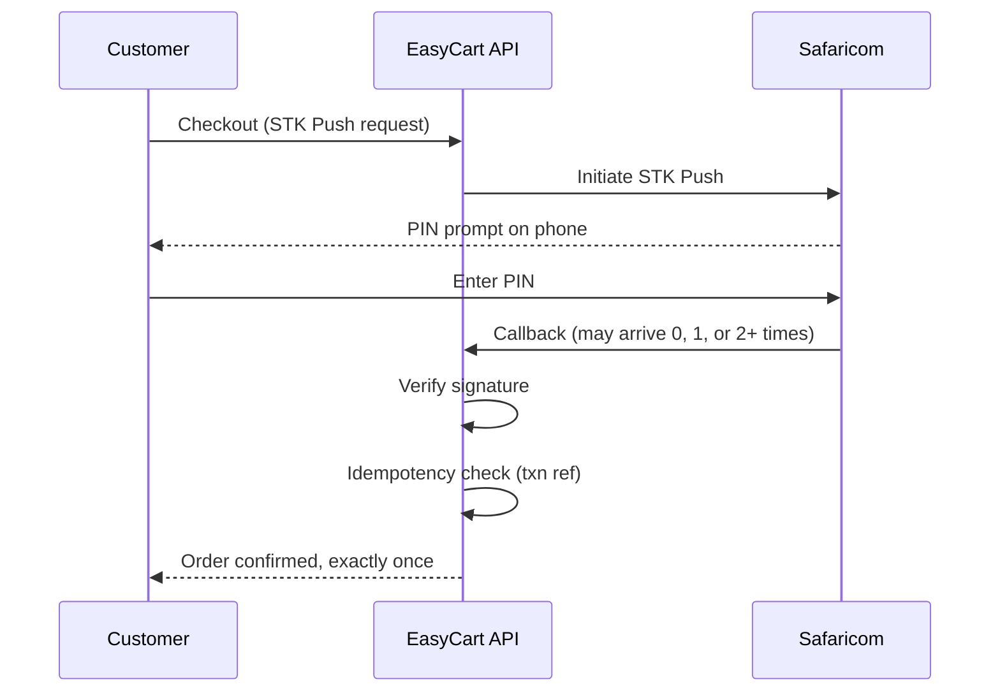

# EasyCart

[](https://github.com/Bryvn01/EasyCart/actions/workflows/ci.yml)
[](https://codecov.io/gh/Bryvn01/EasyCart)
[](LICENSE)

An e-commerce platform with three payment paths — M-Pesa STK Push, card payments via Flutterwave, and PayPal — built for a market where mobile money is the default checkout method but not the only one accepted.

Monorepo: a Django REST API, a Next.js/React storefront, a separate React admin dashboard, and a React Native mobile client (in progress).

## Why M-Pesa shaped most of the payment architecture

STK Push is asynchronous in a way card and PayPal checkouts aren't — you initiate the push, then wait for Safaricom to call back with the result. That callback can arrive more than once (Safaricom retries on timeout), can arrive after the customer has already abandoned and retried checkout, and has to be verified before its payload is trusted at all.

EasyCart handles this with an idempotency layer keyed on the M-Pesa transaction reference (`backend/apps/orders/idempotency.py`, 94% test coverage), so a duplicate callback can't apply twice. Signature verification (`backend/utils/security_helpers.py`) runs before a callback touches order state, enforced in production mode.

Card (`CardPaymentService`, via Flutterwave) and PayPal (`PayPalPaymentService`) payments live in `backend/apps/orders/payment_service.py` and are dispatched from `initiate_payment` in `backend/apps/orders/views.py`, with a shared `PaymentModal.js` on the frontend for method selection. Both are functionally complete and activate as soon as `FLUTTERWAVE_API_KEY` (card) and `PAYPAL_CLIENT_ID` / `PAYPAL_CLIENT_SECRET` (PayPal) are set in the environment — without them, the services return a "not configured" error rather than failing silently. Test coverage for these two paths hasn't caught up to the M-Pesa path yet — see Roadmap.



## Architecture

Four services, one repo:

| Service | Stack | Why it's separate |
|---|---|---|
| `backend/` | Django REST Framework | Owns auth, payments, orders — the parts that can't be wrong |
| `frontend/` | Next.js + React + Tailwind | Customer-facing storefront |
| `admin-dashboard/` | React | Different permission model (RBAC: superadmin/manager/editor/viewer) and release cadence than the storefront |
| `mobile/` | React Native | iOS/Android client, deliberately behind web on feature parity — see Roadmap |

It's a monorepo because the API contract between the backend and both frontends changes often enough that cross-repo versioning would cost more than it saves at this scale.

## Security posture

- JWT auth with rotation and refresh — no long-lived tokens
- OTP request/verify/resend with throttling and cooldowns, so it can't be turned into an SMS-cost attack against the Twilio bill
- TOTP-based 2FA gated to admin accounts
- Four-tier RBAC (`backend/apps/accounts/permissions.py`)
- CSP headers on every response
- M-Pesa webhook signatures verified before processing, always, in production

Dependency and static-analysis scanning runs on every push: `bandit` and `pip-audit` for the Python stack, `npm audit` for both frontends, CodeQL for static analysis. Current state: zero known vulnerabilities in the Python dependency tree and the customer-facing frontend. The admin dashboard has a handful of transitive dev-dependency advisories with no runtime exploit path — tracked in `SECURITY.md` rather than hidden.

## Testing

287 tests, 13 skipped, 0 failing. Coverage isn't chased as a number — it's concentrated where a bug is expensive: orders, payments, and authentication sit above 80%, and the idempotency module specifically sits at 94%, because that's the module standing between a flaky mobile network and a duplicate charge.

```bash
cd backend
pytest --cov=apps --cov-report=html        # full suite, HTML report
pytest --cov=apps.orders --cov-report=term # target one app
```

Frontend and admin dashboard:

```bash
npm test -- --watchAll=false --passWithNoTests
npm run lint
npm run build
```

`.github/workflows/ci.yml` runs the full matrix — backend tests, frontend tests/build, `bandit` / `pip-audit` / `npm audit`, CodeQL — on every push and PR, then deploys to Render (backend) and Vercel (frontend) on green.

## Quick start

**Backend** — API on `localhost:8000`

```bash
cd backend
python -m venv .venv
source .venv/bin/activate          # Windows: .venv\Scripts\activate
pip install -r requirements.txt
cp .env.example .env
python manage.py migrate
python manage.py seed_products
python manage.py runserver
```

**Frontend** — storefront on `localhost:3000`

```bash
cd frontend
npm ci
cp .env.example .env
npm start
```

**Admin dashboard** — run it on a different port, since the storefront usually already owns 3000

```bash
cd admin-dashboard
npm ci
cp .env.example .env
PORT=3001 npm start
```

**Mobile**

```bash
cd mobile
npm ci
cp .env.example .env
npm start
```

Env vars are documented per-service in each `.env.example`. The ones that actually gate functionality: `SECRET_KEY`, `DEBUG`, `ALLOWED_HOSTS`, `CORS_ALLOWED_ORIGINS`, database settings, and the `MPESA_*` / `FLUTTERWAVE_API_KEY` / `PAYPAL_CLIENT_ID` / `PAYPAL_CLIENT_SECRET` / `TWILIO_*` / `CLOUDINARY_*` service keys. Mobile's API base URL is currently hardcoded in `mobile/src/api/client.ts` — update it before testing locally.

## Repo layout

```
backend/            Django REST API — auth, payments, orders, admin APIs
frontend/           Customer storefront (Next.js + React)
admin-dashboard/    Admin web app (React)
mobile/             React Native client
docs/               Setup, deployment, API, security, testing guides
.github/workflows/  CI/CD, security scanning, deployment automation
```

## What's implemented vs. in progress

| Area | Status | Where to look |
|---|---|---|
| Catalog, search/filter | Done | `backend/apps/products/` |
| Cart, checkout, orders | Done | `backend/apps/orders/` |
| JWT auth + refresh | Done | `backend/ecommerce/settings.py` |
| OTP flows | Done | `backend/apps/accounts/otp_views.py` |
| Admin 2FA | Done | `backend/apps/accounts/two_factor_views.py` |
| RBAC | Done | `backend/apps/accounts/permissions.py` |
| M-Pesa STK Push + callbacks | Done | `backend/apps/payments/gateways/mpesa_gateway.py` |
| Idempotency | Done, 94% coverage | `backend/apps/orders/idempotency.py` |
| Card (Flutterwave) & PayPal payments | Implemented — needs `FLUTTERWAVE_API_KEY` / `PAYPAL_CLIENT_ID` + `PAYPAL_CLIENT_SECRET` to activate | `backend/apps/orders/payment_service.py`, `frontend/src/components/PaymentModal.js` |
| Mobile feature parity | Partial | `mobile/src/` — web ships first, mobile catches up |

## Roadmap

- Close the mobile feature-parity gap with web
- Bring card and PayPal payment paths up to the same test coverage as M-Pesa
- Clear the remaining transitive dev-dependency advisories on the admin dashboard

## Docs

- Setup: `docs/setup/QUICK_START.md`
- Deployment: `docs/deployment/DEPLOYMENT_GUIDE.md`
- API reference: `docs/api/`
- Security policy: `SECURITY.md`

## Troubleshooting

- `ModuleNotFoundError: No module named 'django'` — activate the backend venv, then `pip install -r requirements.txt`
- `react-scripts: not found` / `jest: not found` — run `npm ci` in whichever directory is complaining
- CORS or auth errors — check `REACT_APP_API_URL` / `NEXT_PUBLIC_API_URL` against the backend's `CORS_ALLOWED_ORIGINS`
- Payment callback issues — check `MPESA_*` env values and that webhook signature verification is enabled for production mode

## License

MIT — see [LICENSE](LICENSE).
